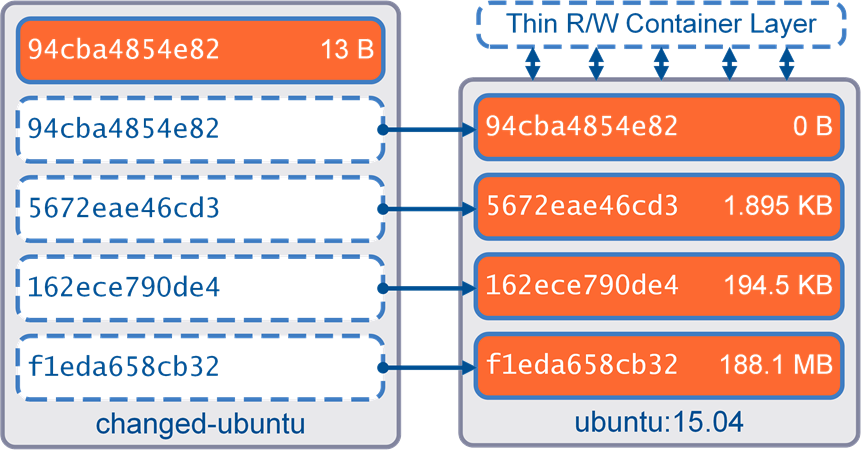

## It's time to look how docker manage container's data 


## 1. Intro to Container data

- Có 2 kiểu dữ liệu cần được nhắc đến 
    - Persistent : bao gồm các dữ liệu cần được lưu giữ : log, record,  audit , event 
    - non-persistent : baom gồm các dữ liệu không cần lưu giữ : guest IP ..


- Trong Docker, các contaier được khởi tạo, các non-persistent storage của chúng cũng được khởi tạo trong thời gian này . Storage này đưowcj gắn liền với vòng đời cuản containre ( tao sống mày sống - tao chết mày chết )

- Thay vì sử dụng loại storage không bền vững, container có thể sử dụng storage driver để quản lý filessystem , cung cấp  storage lâu dài, không đi kèm với vòng đời của các contaier ( 2 thực thể  hoàn toàn ).


## 2. non-persistent storage 

 - Mặc định khi khởi tạo container , các dữ liệu được lưu vào các layer trong container điều này có nghĩa khi container mất, dữ liệu đặt tại các layer cũng mất . Việc lấy dữ liệu từ các layer dường như là không thể, vì vậy sử dụng dữ liệu từ một container này cho các container khác cũng khó khăn .

 


## 3. Persistent storage

- Docker hỗ trợ 2 option để lưu dữ liệu lâu dài cho  các contaier trên host machine
    - volumes : lưu trữ tại : (/var/lib/docker/volumes/ )
    - mounts : với Bind mounts  lưu trữ mọi chỗ trên host filesystem, với tmpfs lưu trên RAM host 

- Trong phần tìm hiểu này sẽ dừng lại tìm hiểu volume

### 3.1 . Docker Volume manager 


- Khởi tạo Volume
```
docker volume create test-volume

$ docker volume inspect test_volume
[
    {
        "CreatedAt": "2019-04-15T16:29:01+07:00",
        "Driver": "local",
        "Labels": {},
        "Mountpoint": "/var/lib/docker/volumes/test_volume/_data",
        "Name": "test_volume",
        "Options": {},
        "Scope": "local"
    }
]

```

- Khởi động container từ volume
```
 docker run -d \
  --name devtest \
  --mount source=test_volume,target=/app \
  nginx:latest
```

- Check insspect container

```
$ docker container inspect devtest

...
 "Mounts": [
            {
                "Type": "volume",
                "Name": "test_volume",
                "Source": "/var/lib/docker/volumes/test_volume/_data",
                "Destination": "/app",
                "Driver": "local",
                "Mode": "z",
                "RW": true,
                "Propagation": ""
            }
...
```