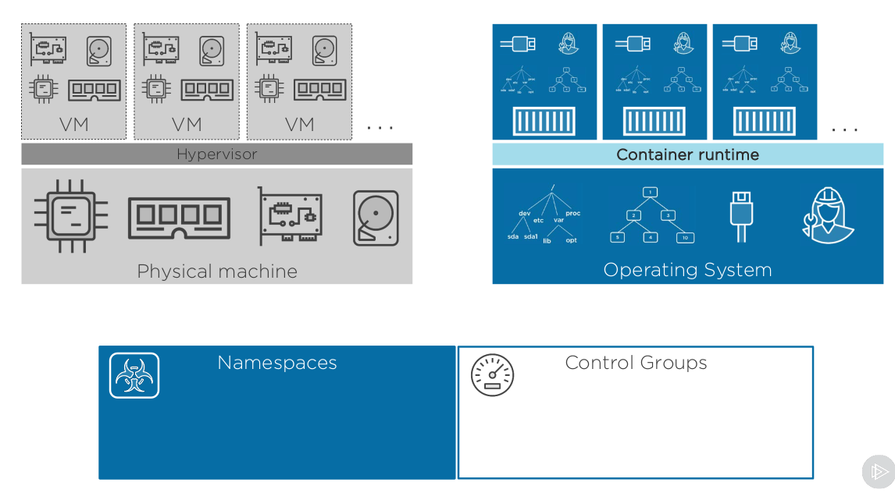
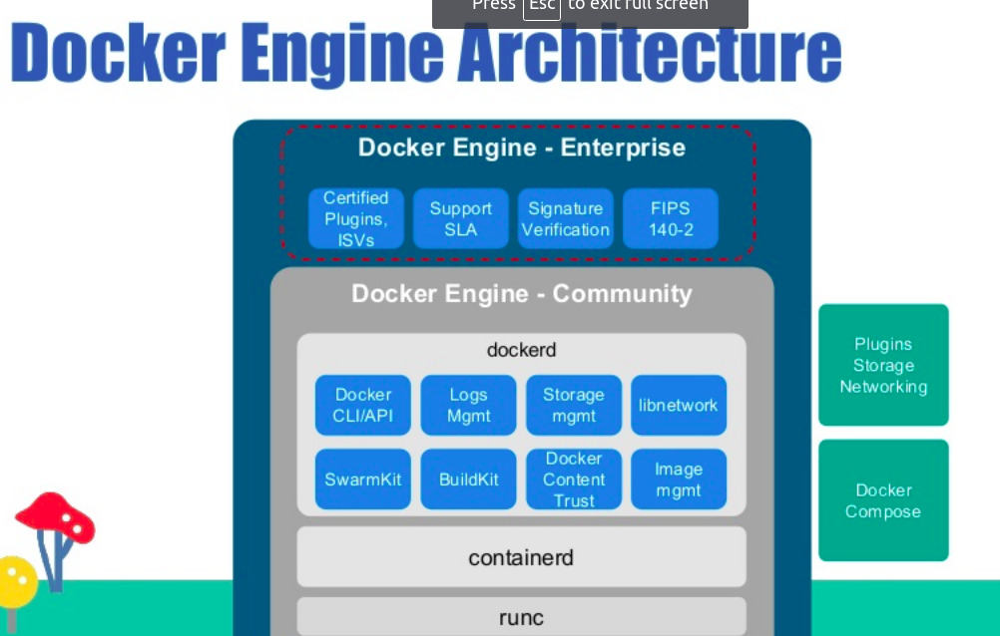
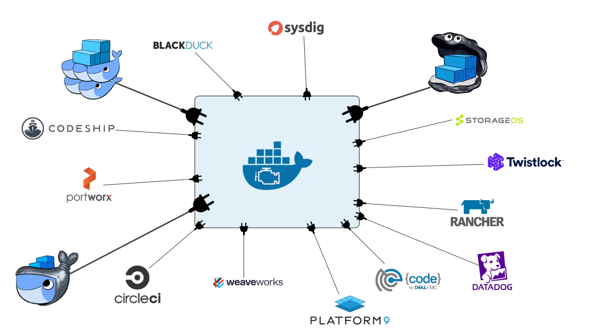
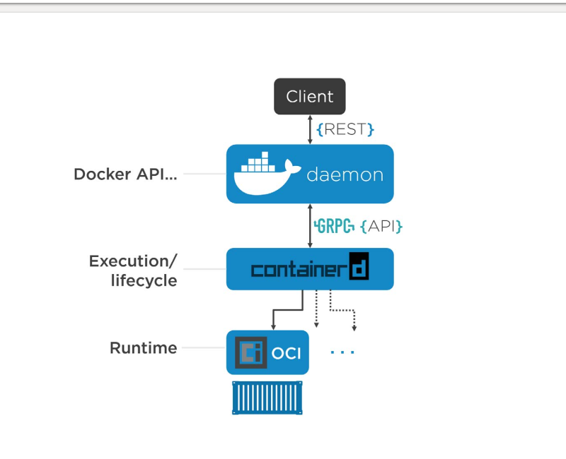

## The big picture : Container

## 1. Container là gì ?

- Hungc
- The traditional way to run an application is to install and run that application directly from a host computer’s file system. That application’s view of its environ-ment would include the host’s process table, file system, IPC facility, network inter-faces, ports, and devices.

- Nó trông "giống " máy ảo

  - có process riêng
  - có network interface
  - có thể chạy với quyền root
  - có thể cài dịch vụ
  - có thể chạy service
  - có thẻ làm việc với routing, iptable

- Nhưng không nó không hoàn toàn là máy ảo

  - sử dụng host kernel
  - không phải là một OS hoàn toàn
  - không có module riêng
  - không có init service

- Container chỉ là một service trên host machine

## 2. Container Kernel

- Namespace là một chức năng trong Linux Kernel, là là một khái niệm cơ bản trong Docker. Namespace là một khái niệm cung cấp khả năng cô lập . Docker sử dụng namespace với mục đích cô lập các container, để tăng khả năng linh hoạt và không ảnh hướng đướng host OS. Các thành phần trong Docker sẽ được năm trên các namespace khác nhau để được kiểm soát về mặt tài nguyên sử dụng . Nói chung namespace dưới mặt process cung cấp cho chúng một hệ thống mới và riêng ( cô lập )

- Namespace bao gồm các lọai sau :

  - PID namespace for process isolation. , only see other process with same PID
  - NET namespace for managing network interfaces. Give their own network with routing table and socket ...
  - IPC namespace for managing access to IPC resources. It allows a process to have own message queue ...
  - MNT namespace for managing filesystem mount points.
  - UTS namespace for isolating kernel and version identifiers.

- Một trong những ứng dụng nổi bật của Namespace trong Docker container là tránh việc leo thang đặc quyền xảy ra trong một container.

- Cgrou ( controll group) : docker sử dụng Cgroup để kiểm soát tài nguyên phân bổ, và cô lập . Một cgroup sẽ hạn chế trên từng tài nguyên, việc này sẽ đảm bảo việc sử dụng tài nguyên được Docker Engine cấp phát cho các container là tối ưu nhất

- Docker sử dụng dụng các cgroup sau
  - Memory cgroup for managing accounting, limits and notifications.
  - HugeTBL cgroup for accounting usage of huge pages by process group.
  - CPU group for managing user / system CPU time and usage.
  - CPUSet cgroup for binding a group to specific CPU. Useful for real time applications and - NUMA systems with localized memory per CPU.
  - BlkIO cgroup for measuring & limiting amount of IO by group.
  - net_cls and net_prio cgroup for tagging the traffic control.
  - Devices cgroup for reading / writing access devices. ( /dev/\* , tty)
  - Freezer cgroup for freezing a group. Useful for cluster batch scheduling, process migration and debugging without affecting prtrace.

- Union File Systems : docker sử dụng UnionFS đẻ xây dựng các block cho các container,

- Docker Engine combines the namespaces, control groups and UnionFS into a wrapper called a container format. The default container format is libcontainer.

* Contaier runtime sử dụng namespace và cgroup

## 3. Docker Engine

- Docker Engine là hoạt động dưới mô hình server-client, sử dụng để build và run các container sử dụng các thành phần và service của Docker. Khi người ta nhắc đến Docker có nghĩa là đang nhắc đến Docker Engine bao gồm các thành phần Docker Daemon , REST API và CLI nói chuyện với Docker daemin bằng API
- Docker Engine là core soft để chạy và quản lý các container. Chúng ta thường gọi nó là Docker hay Docker platform . Ví dụ với VMware , thì nó giống như là ESXI.
- Docker engine là một module được phát triển cho phép nhiều thành phần bổ sung. Chúng dựa vào các chuẩn của OCI
- Docker engine gồm các thành phần chính : Docker client, docker daemon,containerd, runc.
  - Containerd is a container runtime which can manage a complete container lifecycle - from image transfer/storage to container execution, supervision and networking.

