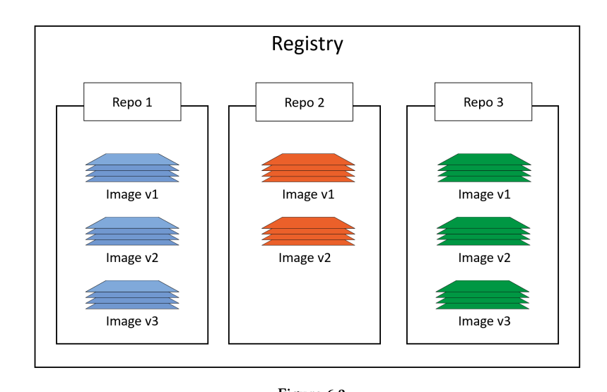

## Tìm hiểu Image trong Docker

## 1. Mở đầu

- Có thể xem Docker image giống như một VM templage ( iso , img, qcow2 ) . Một VM template giống như một VM đã dừng -  image cũng giống như container đã dừng
- Khi chũng ta thực hiện pull một image về  có nghĩa đang tải về image từ registry về docker engine. Docker cung cấp một public registry cho người dùng gọi là Docker Hub. và mặc định cho các Docker client. Người dùng có thẻ tự xây dựng các private registry .
- Mỗi image chủ yếu gồm 2 phần : OS filesystem và application ( file and dependencies )

- Việc xây dựng các image và container chủ yếu để xây dựng các ứng dụng và dịch vụ. Điều này các image tùy vào từng nhu cầu sẽ chứa các OS filesystem và các file và dependencies của các application 


## 2. Làm việc với image

- Các image trên Linux sau khgi được pull sẽ được lưu tại `/var/lib/docker`


- Kiểm tra các image đang có tại local repository
```bash
root@nguyenhungsync:~# docker image ls
REPOSITORY          TAG                 IMAGE ID            CREATED             SIZE

```


- Thực hiện pull image về

```bash
root@nguyenhungsync:~# docker image pull ubuntu:latest
latest: Pulling from library/ubuntu
898c46f3b1a1: Pull complete 
63366dfa0a50: Pull complete 
041d4cd74a92: Pull complete 
6e1bee0f8701: Pull complete 
Digest: sha256:017eef0b616011647b269b5c65826e2e2ebddbe5d1f8c1e56b3599fb14fabec8
Status: Downloaded newer image for ubuntu:latest
root@nguyenhungsync:~# docker image ls
REPOSITORY          TAG                 IMAGE ID            CREATED             SIZE
ubuntu              latest              94e814e2efa8        4 weeks ago         88.9MB

```

- Sợ bộ về Docker Hub



- Các image được pull về sẽ có dạng 
```
<repository>:<tag>
```
- Việc tag cho các image sẽ có thẻ lựa chọn các image trong một resitory, nếu pull image không chỉ định tag , Docker   client sẽ tự hiểu pull image có tag `latest` 

- Tìm kiếm repository từ registry

```
root@nguyenhungsync:~# docker search google --limit 10
NAME                               DESCRIPTION                                     STARS               OFFICIAL            AUTOMATED
google/cadvisor                    Analyzes resource usage and performance char…   360                                     
google/cloud-sdk                   Google Cloud SDKbundle with all components a…   242                                     [OK]
google/golang                                                                      104                                     [OK]
google/docker-registry             Docker Registry w/ Google Cloud Storage driv…   38                                      
google/nodejs-hello                                                                25                                      [OK]
jaymoulin/google-music-uploader    Docker Image to upload music library to Goog…   5                                       
rpmdpkg/docker-google-mirror       Google-mirror                                   2                                       [OK]
dsarshad/google-news-api-latest    google-news-api                                 2                                       [OK]
cfje/google-stackdriver-profiler   Google Stackdriver Profiler Builder Image       0                                       
cfje/google-stackdriver-debugger   Google Stackdriver Debugger Builder
```


- Ngoài ra docker iamge còn cung cấp khả năng filter , giúp lọc các image theo yêu cầu của người dùng. 

## 3. Deploy private image registry server 


- Docker image được lưu trữ tập trung tại các image registry  . Image registry phổ biến hệ nay là Docker Hub, bên cạnh đó sẽ có các registry từ các bên thứ 3 cung cấp tuy nhiên điểm chung của các registry là tập hợp từ nhiều ccác repository, và trong repository sẽ chứa nhiều image. 


### Back Soon 


## 4. Docker Image Layer 

- Một image thực chất bao gồm các layer được inter connect với nhau ở mode read-only . 


- Docker đảm nhiệm việc sắp xếp các layer này để thể hiện image như một thể thống nhất. Để xem được các layer của image ta có thể sử dụng
```
root@nguyenhungsync:~# docker image pull nginx:latest
latest: Pulling from library/nginx
27833a3ba0a5: Pull complete 
eb51733b5bc0: Pull complete 
994d4a01fbe9: Pull complete 
Digest: sha256:50174b19828157e94f8273e3991026dc7854ec7dd2bbb33e7d3bd91f0a4b333d
Status: Downloaded newer image for nginx:latest

```

- Với mỗi dòng `Pull complete` từ output của command trên là hiển thị cho 1 layer trong image đã được pull về

- Ta có thể  xem được các layer của image đã được pull từ sẵn 
```
root@nguyenhungsync:# docker image inspect nginx:lasted
....
    "RootFS": {
            "Type": "layers",
            "Layers": [
                "sha256:5dacd731af1b0386ead06c8b1feff9f65d9e0bdfec032d2cd0bc03690698feda",
                "sha256:b0a13438d0d39cb4d9d355a0618247f94b97a38208c8a2a4f3d7d7f06378acb2",
                "sha256:19d384dcffcccd44d9f475ed776358a81fb05e7948249bb50f8d7784e0f0f433"
            ]
        },
        "Metadata": {
            "LastTagTime": "0001-01-01T00:00:00Z"
        }
...
```

- Ouput trả về cũng bao gồm 3 layer của image. Tuy nhiên tại đây các layer  đã được hash bằng sha256. Tất cả image docker đều được xây dựng từ một image base, và khi có một thay đổi mới thì sẽ được đưa vào một layer mới và đặt ở đầu . Ví dụ như image nginx trên, có thể được xây dựng nhờ image base `ubuntu:latest`, và là layer số 1, sau đó sẽ cài thêm `nginx package` sẽ được đưa vào layer 2 , `php7 package` sẽ được đưa vào layer 3. 


## 5. Docker image deep dive

- Docker container xây dựng các block application. Mỗi container sẽ là một image ở trạng thái running, chứa các layer ở trạng tháo read only

- Những layer này được sinh ra khi thực hiện một command từ Dockerfile khi thực hiện image build. 
- Ví dụ về Dockerfile
```
FROM node:argon
# Create app directory
RUN mkdir -p /usr/src/app
WORKDIR /usr/src/app
# Install app dependencies
COPY package.json /usr/src/app/
RUN npm install
# Bundle app source
COPY . /usr/src/app
EXPOSE 8080
CMD [ "npm", "start" ]
```
- Đối với dockerfiler trên,  khi build image mỗi bước ở trong file tương ứng với một command được thực hiện . Và một layer dược tạo ra từ việc chạy một command. 


- Nhưng đối với việc xây dựng Dockerfiler như trên sẽ tạo ra nhiều layer giống nhau trên các container có cùng base layer. Cơ cheé shared layer được sinh ra, nhiều image có thể cùng sử dụng chung một image để tiết kiệm tài nguyên và tăng hiệu năng. 


- Thực hiện pull tất cả image version 
```
root@nguyenhungsync:~# docker image pull -a nigelpoulton/tu-demo
latest: Pulling from nigelpoulton/tu-demo
237d5fcd25cf: Pull complete 
a3ed95caeb02: Pull complete 
67af04f3d17e: Pull complete 
77438cb581f6: Pull complete 
c214d14fbb8e: Pull complete 
cc4d2d9ad9a2: Pull complete 
d43d1b29996a: Pull complete 
876629e24729: Pull complete 
64b9eb3064cd: Pull complete 
325ac6e6772a: Pull complete 
Digest: sha256:42e34e546cee61adb100144aed000d90e6dc403a0c5b53f324a9e1c1aae451e9
v1: Pulling from nigelpoulton/tu-demo
237d5fcd25cf: Already exists 
a3ed95caeb02: Already exists 
67af04f3d17e: Already exists 
77438cb581f6: Already exists 
c214d14fbb8e: Already exists 
cc4d2d9ad9a2: Already exists 
d43d1b29996a: Already exists 
876629e24729: Already exists 
64b9eb3064cd: Already exists 
325ac6e6772a: Already exists 
Digest: sha256:9ccc0c67e5c5eaae4bebeeed9b22e0e22f8a35624c1d5c80f2c9623cbcc9b59a
v2: Pulling from nigelpoulton/tu-demo
237d5fcd25cf: Already exists 
a3ed95caeb02: Already exists 
67af04f3d17e: Already exists 
77438cb581f6: Already exists 
c214d14fbb8e: Already exists 
cc4d2d9ad9a2: Already exists 
d43d1b29996a: Already exists 
876629e24729: Already exists 
64b9eb3064cd: Already exists 
eab5aaac65de: Pull complete 
Digest: sha256:d3c0d8c9d5719d31b79cca146025fa7d1de4749fef58a7e038cf0ef2ba5eb74c
Status: Downloaded newer image for nigelpoulton/tu-demo


```


- Kiểm tra các image đã pull thành công

```
root@nguyenhungsync:~# docker image ls
REPOSITORY             TAG                 IMAGE ID            CREATED             SIZE
nigelpoulton/tu-demo   v2                  6ac21e29bead        2 years ago         212MB
nigelpoulton/tu-demo   latest              9b915a241e29        2 years ago         212MB
nigelpoulton/tu-demo   v1                  9b915a241e29        2 years ago         212MB

```

- Kiểm tra lại quá trình pull image sẽ thấy xuất hiện `Already exists `, có nghĩa sau khi pull được image `;asted` , đến pull v2 image, docker image phát hiện image 2 có cùng layer content - excute command nên đã sử dụng layer của version lastest thay vì thực hiện pull 

- Ngoài ra việc change content của image là không thể  , từ Docker 1.0 mỗi layer đã có riêng một cryto ID , và các content đã được bash. 


### 6. Multi-architecture image 

- DOcker image cho phép build các image chạy được tên nhiều CPU platform . Có nghiã là với một image tag có thể chạy trên Linux, arm, Windows x64

- Để cấu hình các image có thể chạy trên nhiều kiến trúc CPU sẽ làm việc với   `manifest list`
