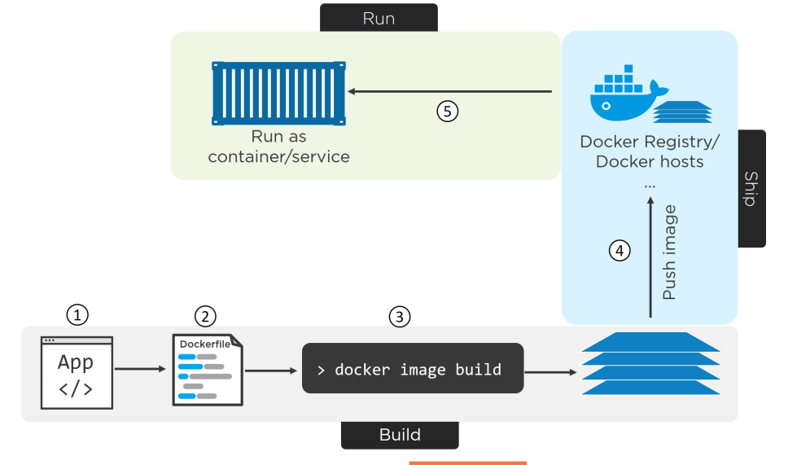

## Chaỵ application trên nền tảng Docker


## 1. containerizing

- Docker is all about taking applications and running them in containers.
- Việc cài đặt, cấu hình các ứng dụng để chạy trên nền container được gọi là “containerizing”.
- Trong hệ sinh thái container "Container are about app". Container giúp việc triển khai ( so với VM )  ứng dụng dễ dàng hơn với 3 step : build, ship, run 

- Các quá trình để đóng container của một app chủ yếu bao gồm :
    - Viết code chương trình
    - Khởi tạo dockerfile, bao gồm môi trường,  chứa code, các chúng hoạt động
    - Build image từ docker file
    - Khởi chạy ứng dụng
 


## 2. Dockerfile 


- Docker build sẽ xây dựng các image dựa vào các chỉ thị trong các `Dockerfile`. Tronng Dockerfile sẽ chứa các yêu cầu cho việc build một image theeo cấu trúc mà Docker yêu cầu
- Cú pháp trong Dockerfile
```
INSTRUCTION argument 
```

Trong đó : 
    - INSTRUCTION : bao gồm cả chỉ thị được viết hoa
    - argument : bao gồm các công việc mà chỉ thị muốn thực hiện
    - Một Dockerfile sẽ bao gồm chỉ thị `FROM` ở đầu để chỉ thị base image ( base layer )


- Các thỉ thị cụ thể trong Dockerfile

- FROM : chỉ ra image cơ sở cho imgae được xây dựng,  chỉ ra image base. Có thể sử dụng `FROM` nhiều lần để build nhiều image 
```
FROM image[:tag] 
FROM image[:tag] [as_name]
```

- RUN : sử dụng để chạy một command trong quá trình build image
```
RUN command ( use default shell)
RUN ["executable", "param1", "param2"] ( use exec command)
```

- CMD : thực hiện một command khi Docker Container khởi chạy từ image, khác với RUN , được chạy khi thực hiện build image . Một container ở dạng runtime chỉ có thể có một CMD thuộc 1 trong 3 dạng CMD sau : 
```
CMD ["executable","param1","param2"] (exec form)
CMD ["param1","param2"] (as default parameters to ENTRYPOINT)
CMD command  (shell form)```
```

- ENTRY POINT : Trong Dockerfile, tác dụng của CMD và ENTRY POINT có tác dụng giống nhau, nếu trong Dockerfile có cùng cả 2 CMD sẽ trở thành para cho ENTRY . ENTRY có thể biến container thành một excuteable app
```
FROM ubuntu
ENTRYPOINT top -b

#!  docker run -it --name test top

ENTRYPOINT ["executable", "param1", "param2"] (exec form)
ENTRYPOINT command param1 param2 (shell form)
```

- SHELL : sử dụng shell default trong kernel để thực hiện command
```
SHELL ["executable", "parameters"]
```

- ENV :  thiết lập các biến môi trường
```
ENV <key> <value>
ENV <key>=<value> 
```

- LABEL : chỉ thị các layer metadata


- USER : chỉ định USER trên host OS để chạy container cũng như để exec các command

- WORKDIR :    chỉ định thư mục để exec các lệnh chỉ thị 

- EXPOSE : chỉ định các cổng mà Contaier sẽ lắng nghe . ở đây là cổng lắng nghe, không liên quan đến NAT port nữa host OS và container. Sử dụng TCP làm protocol mặc định
EXPOSE <port> [<port>/<protocol>...]
- VOLUME : chỉ định thư mục từ HOST OS được mount và container ( như một block volume cho các máy ảo ). Thư mục chứa volume "/var/lib/docker/volume"


- ADD : chỉ định thư mục, file tại vị trí  đang chứa Dockerfile hoặc từ remote file sẽ được copy vào filesystem trong image 
```
ADD [--chown=<user>:<group>] <src>... <dest>
ADD [--chown=<user>:<group>] ["<src>",... "<dest>"] (this

```

- COPY : khác với ADD không hỗ trợ download remote file 
```
COPY [--chown=<user>:<group>] <src>... <dest>
COPY [--chown=<user>:<group>] ["<src>",... "<dest>"]
```

- ARG : chỉ định các variable ( par) mà user có thể nhập vào - tùy biến trong quá trình build image 
```
ARG  CODE_VERSION=latest
FROM base:${CODE_VERSION}
```
- MAINTAINER <name> : Author of image

## 4. dockerignore

- Sử dụng `.dockerignore` để loại bỏ các file và thư mục không cần thiết khi build image.


## 5. Build Container single app 

- Thực hiện clone code node JS APP trên github \
```
root@nguyenhungsync:~# git clone https://github.com/contentful/the-example-app.nodejs.git
Cloning into 'the-example-app.nodejs'...

remote: Enumerating objects: 2, done.
remote: Counting objects: 100% (2/2), done.
remote: Compressing objects: 100% (2/2), done.
remote: Total 2848 (delta 0), reused 0 (delta 0), pack-reused 2846
Receiving objects: 100% (2848/2848), 6.46 MiB | 137.00 KiB/s, done.
Resolving deltas: 100% (1712/1712), done.
root@nguyenhungsync:~# cd the-example-app.nodejs

```

- Thực hiện lên phương pháp xây dựng Dockerfile  cho app
```
cat <<EOF> Dockerfile
FROM node:9

WORKDIR /app

RUN npm install -g contentful-cli

COPY package.json .
RUN npm install

COPY . .

USER node
EXPOSE 3000

CMD ["npm", "run", "start:dev"]

EOF

```

- Thực hiện build image ( một số vaasdn đè đến security trong version của các package )
```
root@nguyenhungsync:~/the-example-app.nodejs# docker image build -t nodejs:latest .
Sending build context to Docker daemon  8.079MB
Step 1/7 : FROM node:9
9: Pulling from library/node
d660b1f15b9b: Pull complete 
46dde23c37b3: Pull complete 
6ebaeb074589: Pull complete 
e7428f935583: Pull complete 
eda527043444: Pull complete 
f3088daa8887: Pull complete 
1ded38ff7fdc: Pull complete 
da44c9274f48: Pull complete 
Digest: sha256:cddc729ef8326f7e8966c246ba2e87bad4c15365494ff3d681fa6f022cdab041
Status: Downloaded newer image for node:9
 ---> 08a8c8089ab1
Step 2/7 : RUN npm install -g contentful-cli
 ---> Running in 63128e08ac35
npm WARN deprecated joi@13.7.0: This version has been deprecated in accordance with the hapi support policy (hapi.im/support). Please upgrade to the latest version to get the best features, bug fixes, and security patches. If you are unable to upgrade at this time, paid .........

/usr/local/bin/contentful -> /usr/local/lib/node_modules/contentful-cli/bin/contentful.js

> spawn-sync@1.0.15 postinstall /usr/local/lib/node_modules/contentful-cli/node_modules/spawn-sync
> node postinstall

+ contentful-cli@0.26.2
added 490 packages in 43.377s
Removing intermediate container 63128e08ac35
 ---> 4f734d8e2159
Step 3/7 : WORKDIR /src
 ---> Running in 4f52be0a046d
Removing intermediate container 4f52be0a046d
 ---> f0b34f070069
Step 4/7 : COPY package.json .
 ---> ba215dc4419c
Step 5/7 : RUN npm install
 ---> Running in 725a19d3088d
npm WARN notice [SECURITY] braces has the following vulnerability: 1 low. Go here for more details: https://nodesecurity.io/advisories?search=braces&version=1.8.5 - Run `npm i npm@latest -g` to upgrade your npm version, and then `npm audit` to get more info.
npm WARN deprecated circular-json@0.3.3: CircularJSON is in maintenance only, flatted is its successor.

> nodemon@1.18.11 postinstall /src/node_modules/nodemon
> node bin/postinstall || exit 0

Love nodemon? You can now support the project via the open collective:
 > https://opencollective.com/nodemon/donate

npm notice created a lockfile as package-lock.json. You should commit this file.
npm WARN optional SKIPPING OPTIONAL DEPENDENCY: fsevents@1.2.7 (node_modules/fsevents):
npm WARN notsup SKIPPING OPTIONAL DEPENDENCY: Unsupported platform for fsevents@1.2.7: wanted {"os":"darwin","arch":"any"} (current: {"os":"linux","arch":"x64"})

added 866 packages in 23.168s
Removing intermediate container 725a19d3088d
 ---> ee67ce1b5d30
Step 6/7 : EXPOSE 8080
 ---> Running in abea70a0f2c5
Removing intermediate container abea70a0f2c5
 ---> 01209a321670
Step 7/7 : ENTRYPOINT ["npm", "run", "start:dev"]
 ---> Running in 9d8dceb13e88
Removing intermediate container 9d8dceb13e88
 ---> 42d07931ba2c
Successfully built 42d07931ba2c
Successfully tagged nodejs:latest

```


- Kiểm tra danh sách image
```
root@nguyenhungsync:~# docker image ls
REPOSITORY             TAG                 IMAGE ID            CREATED              SIZE
nodejs                 latest              42d07931ba2c        About a minute ago   850MB
      
```

- Inspect Image
```
docker image inspect nodejs

```

- Login vào Docker Hub

```
root@nguyenhungsync:~# docker login
Login with your Docker ID to push and pull images from Docker Hub. If you don't have a Docker ID, head over to https://hub.docker.com to create one.
Username: nguyenhungsync
Password: 
WARNING! Your password will be stored unencrypted in /root/.docker/config.json.
Configure a credential helper to remove this warning. See
https://docs.docker.com/engine/reference/commandline/login/#credentials-store

```

- Để thực hiện pull image cần chú ý đến 3 thông số Registry ( default : docker.io), Repostiry ( not value default ) , tag ( default : latest ). Giá trị repository được get từ thông tố của image được pull lên .  Như trên thì hiện tại repository đang là nodejs và hiện tại với tài khoản đã đăng nhập không thể access vào nodejs repository . Các repository cá nhân đang ở level-2 ví dụ `nguyenhungsync` nên cần chỉnh sửa tag cho image 
```
docker image tag nodejs:latest nguyenhungsync/nodejs:latest

```

- Thực hiện pull image
```
root@nguyenhungsync:~# docker image push nguyenhungsync/nodejs:latest
The push refers to repository [docker.io/nguyenhungsync/nodejs]
ab3e52d8949d: Pushed 
e954ba9dcef0: Pushed 
ab0dd510b2af: Pushed 
d58ea6a4d00b: Pushed 
71521673e105: Mounted from library/node 
7695686f75c0: Mounted from library/node 
e492023cc4f9: Mounted from library/node 
cbda574aa37a: Mounted from library/node 
8451f9fe0016: Mounted from library/node 
858cd8541f7e: Mounted from library/node 
a42d312a03bb: Mounted from library/node 
dd1eb1fd7e08: Mounted from library/node 
latest: digest: sha256:c39687d8b8fc9ab8e64ec3982de10329f8148bc39fad0a7b8312fcd08542eadf size: 2845

```

- Chạy container . Nodejs đã được cấu hình nghe trên cổng 3000 tại app.js và được khai baáo tại EXPOSE. Thực hiện map port 80 trê host OS đến 8080 trên container. Nếu host os đang sử dụng 80 để lnắng nghe ở dịch vụ khác thì có thể thay thế port mapping. Và `-d` sẽ cho phép container run ở mode background

```
docker container run -d -p 80:3000 nodejs:latest

root@nguyenhungsync:~/the-example-app.nodejs# docker container  ls
CONTAINER ID        IMAGE               COMMAND               CREATED             STATUS              PORTS                  NAMES
7cb3b851c05e        nodejs:latest       "npm run start:dev"   5 seconds ago       Up 5 seconds        0.0.0.0:80->3000/tcp   festive_raman


```

- Kiểm tra trên host OS

