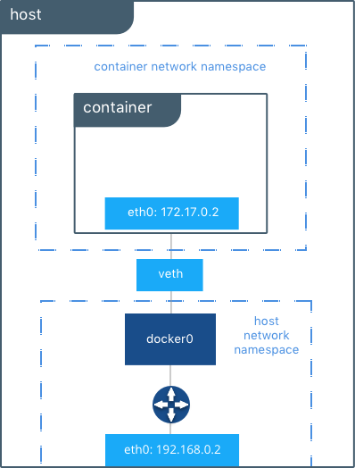

## The Container Networking Model

- No network - no app


## 1. Docker Network Architecture 

- On Linux, Docker manipulates iptables rules to provide network isolation. This is an implementation detail, and you should not modify the rules Docker inserts into your iptables policies.

- Kiến trúc mạng của Docker được xây dựng bởi nhiều interface được gọi là The Docker Networking Model ( CNM ), CNM cung cấp tính linh động ( về network)  cho các ứng dụng trên các hạ tầng khác nhau  , cũng như sử dụng được các tính năng tối ưu và khả năng riêng trên tầng cơ sở hạ tầng


### 1.1 CNM Constructs

- Trong CNM bao gồm các khác niệm sau :
    - Sandbox : bao gồm các cấu hình của các thạnh phần mạng mạng trong container . Bao gồm cấu hình về routing table, container interface, port, dns. Trên Linux sử dụng network namespace để xây dựng tùy vào các cấu hình
    - Endpoint : endpoint thuộc về Sandbox để kết nối với network . Đây là một VNIC, khởi tạo và cung cấp kết nối như mạng physical 
    - Network : làm việc với cấc driver cung cấp hạ tầng mạng có thể là bridge, VXLAN.. Các network này bao gồm nhiều các endpoint .


### 1.2 CNM Driver Interfaces


- The container networking model cung cấp 2 driver interface để người phát triển có thể phát triển các chức năng và quản lý network

- Hiện tại có 2 driver interface sau :
    - Network Drivers : cung cấp các cấu hình, tích hợp để xây dựng một network có thể hoạt động. Docker network driver có thể sử dụng các driver khác trong các    trường hợp khác nhau. 
        - Native Network Drivers : các driver được builin trong Dockker
        - Remote Network Drivers : được phát triển bởi cộng động, sử dụng để tích hợp với các phần cứng hoặc phần mền 
    - IPAM Drivers  :  IP Address Management Drive cung cấp khả năng quản lý subnet và IP trên từng network. cũng như quản lý các endpoint. (infoblox)


- Docker Native Network Drivers
    - host : container sử dụng network thật của host OS. Với driver này không có sự cô lập xảy ra, các interface của host OS có  gắn trực tiếp vào các container

    
    - Bridge : sử dụng Linux Bridge khởi tạo và quản lý các bridge ảo . Mặc định mạng bridge được sử dụng để kết nối cho các container . Sử dụng `brctl` để kiểm tra

    
    - Overlay : xây dựng mạng overlay trên hậ tầng vật lý, cung cấp khả năng kết nối container-container trong môi trường container phân bổ trên nhiều host OS ( cluster ). Sử dụng công nghệ VXLAN để xây dựng overlay network và Linux Bridge để kết nội nội bộ

    
    - MACVLAN :  Macvlan networks allow you to assign a MAC address to a container, making it appear as a physical device on your network. The Docker daemon routes traffic to containers by their MAC addresses. Using the macvlan driver is sometimes the best choice when dealing with legacy applications that expect to be directly connected to the physical network, rather than routed through the Docker host’s network . 

    
    - None : các container sẽ không được gắn virtual network interface


### 1.3. Network Scope :

- Mỗi Nework Driver trong Docker gồm 2 scope : local và swarm . Đối với các local scopce thì các driver provider chỉ có thể quản lý trên host hiện tại ,  với swarm scope cung cấp khả năng quản lý network trên cluster
```
root@nguyenhungsync:~# docker network ls
NETWORK ID          NAME                  DRIVER              SCOPE
67d889a34de5        bridge                bridge              local
fcf0412cf870        host                  host                local
6cdf309213ce        none                  null                local
85dbc68c76e5        testcompose_default   bridge              local
root@nguyenhungsync:~# 

```


## 2 : Docker Host Network Driver


- Nếu sử dụng host network driver, docker' netwokr hoàn toàn không được cô lập và sử dụng tài  nguyên trên host OS. Ví dụ container bind port 80. Khi container ở runtime, thì port 80 củ application cũng được bind vào host'IP
- Đối với các mạng khác thì mỗi container sẽ dược đặt vào namesapce để cung cấp khả năng xaady dựng mạng cô lập . Với host nework , container hoàn toàn không sử dụng network namepsace và thay đó sử dụng IP stack ( TCP/IP) của host  . Các container cungdf sử dụng một host'interface thì không thể cùng bind vào 1 port chung. 


- Khởi tạo một container từ `host` network
```
docker run -itd --net host --name nginx


root@nguyenhungsync:~# docker run -it --net host --name C1 alpine sh
/ # ip a
1: lo: <LOOPBACK,UP,LOWER_UP> mtu 65536 qdisc noqueue state UNKNOWN qlen 1000
    link/loopback 00:00:00:00:00:00 brd 00:00:00:00:00:00
    inet 127.0.0.1/8 scope host lo
       valid_lft forever preferred_lft forever
    inet6 ::1/128 scope host 
       valid_lft forever preferred_lft forever
2: enp3s0: <NO-CARRIER,BROADCAST,MULTICAST,UP> mtu 1500 qdisc fq_codel state DOWN qlen 1000
    link/ether 50:9a:4c:c2:2a:4f brd ff:ff:ff:ff:ff:ff
3: wlp2s0: <BROADCAST,MULTICAST,UP,LOWER_UP> mtu 1500 qdisc mq state UP qlen 1000
    link/ether cc:2f:71:8e:bd:c7 brd ff:ff:ff:ff:ff:ff
    inet 192.168.88.109/24 brd 192.168.88.255 scope global dynamic wlp2s0
       valid_lft 76416sec preferred_lft 76416sec
    inet6 fe80::45f7:d7c:6358:9003/64 scope link 
       valid_lft forever preferred_lft forever
4: virbr0: <NO-CARRIER,BROADCAST,MULTICAST,UP> mtu 1500 qdisc noqueue state DOWN qlen 1000
    link/ether 52:54:00:d2:af:a9 brd ff:ff:ff:ff:ff:ff
    inet 192.168.122.1/24 brd 192.168.122.255 scope global virbr0
       valid_lft forever preferred_lft forever
5: virbr0-nic: <BROADCAST,MULTICAST> mtu 1500 qdisc fq_codel master virbr0 state DOWN qlen 1000
    link/ether 52:54:00:d2:af:a9 brd ff:ff:ff:ff:ff:ff
6: docker0: <NO-CARRIER,BROADCAST,MULTICAST,UP> mtu 1500 qdisc noqueue state DOWN 
    link/ether 02:42:e5:62:f3:2c brd ff:ff:ff:ff:ff:ff
    inet 172.17.0.1/16 brd 172.17.255.255 scope global docker0
       valid_lft forever preferred_lft forever
7: br-85dbc68c76e5: <NO-CARRIER,BROADCAST,MULTICAST,UP> mtu 1500 qdisc noqueue state DOWN 
    link/ether 02:42:4b:0f:a4:84 brd ff:ff:ff:ff:ff:ff
    inet 172.18.0.1/16 brd 172.18.255.255 scope global br-85dbc68c76e5
       valid_lft forever preferred_lft forever


```


## 3 : Docker Bridge Network Driver


### 3.1 : Default Docker Bridge Network

- Mặc đinh trong Docket network sẽ có một network `bridge` mới mode `bridge`, khởi tạo ra một bridge tên `docker0`. Mạng này được attack vào các container trường hợp network không được chỉ định khi khởi động container
```
root@nguyenhungsync:~# brctl show
bridge name	bridge id		STP enabled	interfaces
br-85dbc68c76e5		8000.02424b0fa484	no		
docker0		8000.0242e562f32c	no		
virbr0		8000.525400d2afa9	yes		virbr0-nic

```

- Khởi động một container mới. Được khởi tạo một interface với veth eth0@f12 được cung cấp IP bởi Docker IPMA
```
root@nguyenhungsync:~# docker run -it --name c1 busybox sh
Unable to find image 'busybox:latest' locally
latest: Pulling from library/busybox
fc1a6b909f82: Pull complete 
Digest: sha256:954e1f01e80ce09d0887ff6ea10b13a812cb01932a0781d6b0cc23f743a874fd
Status: Downloaded newer image for busybox:latest
/ # ip a
1: lo: <LOOPBACK,UP,LOWER_UP> mtu 65536 qdisc noqueue qlen 1000
    link/loopback 00:00:00:00:00:00 brd 00:00:00:00:00:00
    inet 127.0.0.1/8 scope host lo
       valid_lft forever preferred_lft forever
8: eth0@if9: <BROADCAST,MULTICAST,UP,LOWER_UP,M-DOWN> mtu 1500 qdisc noqueue 
    link/ether 02:42:ac:11:00:02 brd ff:ff:ff:ff:ff:ff
    inet 172.17.0.2/16 brd 172.17.255.255 scope global eth0
       valid_lft forever preferred_lft forever

```

- Kiểm tra lại brctl, hiện bridge đã có một interface veth kết nối với interface veth trong container . 
```
root@nguyenhungsync:~# brctl show
bridge name	bridge id		STP enabled	interfaces
br-85dbc68c76e5		8000.02424b0fa484	no		
docker0		8000.0242e562f32c	no		veth8be6cfc
virbr0		8000.525400d2afa9	yes		virbr0-nic
root@nguyenhungsync:~# 

```

- Kiểm tra Routing table trong container
```
/ # ip route
default via 172.17.0.1 dev eth0 
172.17.0.0/16 dev eth0 scope link  src 172.17.0.2 

```

- Kiểm tra trên host interface sẽ thấy một veth connect được khởi tạo
```

host #~ :  ip a
9: veth8be6cfc@if8: <BROADCAST,MULTICAST,UP,LOWER_UP> mtu 1500 qdisc noqueue master docker0 state UP group default 
    link/ether 4e:73:ca:1f:f3:86 brd ff:ff:ff:ff:ff:ff link-netnsid 0
    inet6 fe80::4c73:caff:fe1f:f386/64 scope link 
       valid_lft forever preferred_lft forever

```


- Packetflow



### 3.2 User-Defined Bridge Networks

- Người dùng có thể tự định nghĩa network , bên cạnh đó có thể tùy chọn IP cho các container thay thì sử dụng Docker IPAM để cấp phát IP 

- Khởi tạo nework mới
```bash
root@nguyenhungsync:~# docker network create --driver bridge --subnet 10.20.30.0/24 my_bridge
e66c99edcd07f3279d0e1b7ad0e659bef1debb43d4d51ed228df510af697ec1d
root@nguyenhungsync:~# docker network ls
NETWORK ID          NAME                  DRIVER              SCOPE
67d889a34de5        bridge                bridge              local
fcf0412cf870        host                  host                local
e66c99edcd07        my_bridge             bridge              local
6cdf309213ce        none                  null                local
85dbc68c76e5        testcompose_default   bridge              local
```


- Khởi động 2 container cùng 1 mạng
```
docker run -it --name c2 --net my_bridge busybox sh

docker run -it --name c3 --net my_bridge busybox sh
```

- Thực hiện PING từ c2 sang c3
```
/ # ping 10.20.30.3
PING 10.20.30.3 (10.20.30.3): 56 data bytes
64 bytes from 10.20.30.3: seq=0 ttl=64 time=0.165 ms
64 bytes from 10.20.30.3: seq=1 ttl=64 time=0.155 ms
64 bytes from 10.20.30.3: seq=2 ttl=64 time=0.139 ms
.....

```

- Packetflow


### 3.3. External Access to Container

- Mỗi container cũng giống như mọi động mạng mạng đều có 2 chiều : ingress và exgress
    - Việc truy cập từ containrer ( exgress )  ra mạng ngoài sẽ được sử dụng công nghệ  masqueraded/SNATed (ypically in the range of 32768 to 60999) tại các bridge  interface 
    - Việc truy cập từ mạng ngoài vào container ( ingress ) cần  được thực hiện  port mapping giữa host và container . 

- Packetflow


- Để mấu hình port maping cho phép các mạng ngoài truy xuất vào các container sẽ sử dụng option  `--publish / -p `
```
docker run -d --name C2 --net bridge -p <hostport>:<container explose port> nginx
```


## 4. Overlay Driver Network Architecture


- Tìm hiểu VXLAN : https://github.com/nguyenhungsync/Openstack_Research/blob/master/Neutron/7.%20VXLAN.md
- LAB XVLAN Tunnel with OpenvSwitch   : https://github.com/nguyenhungsync/Openstack_Research/blob/master/Neutron/11.%20VXLAN-Tunnel.md

- Về mặt bản chất OpenvSwitch và Linux Bridge cả 2 đều xây dựng switch ảo 


- How VXLAN Work


## 5. MACVLAN


### 5.1. FLAT NETWORK 
- Thay vì sử dụng Linux Bridge để cách ly mạng , có thể sử dụng MACVLAN thay thế . MACVLAN cho phép liên kết với interface hoặc  sub-interface ( VLAN)  và kết nối ra mạng vật lý . MACVLAN cho phép kết nối trực tiếp giũa mạng vật lý ( hạ tầng mạng) với container thay vì phải thông qua host interface ( không nhờ host định tuyến). Các container sử dụng MACVLAN được thừa hưởng routing table từ host 


- Trong MACVXLAN sử dụng khái niệm cổng cha. Có thể là intefface ( eth0 ) hoặc là sub-interface (eth0.10 - VLAN 10 tagged ). Gateway yêu cầu trong MACVLAN là gateway của hạ tầng mạng thật . Trong mode mạng này host interface chỉ đảm nhiệm chuyển frame cho các container ( Switch Layer 2 )


- Khởi tạo mạng
```
docker network create -d macvlan --subnet 192.168.0.0/24 --gateway 192.168.0.1 -o parent=eth0 mvnet
```


### 5.2. VLAN  NETWORK 


- Nếu hạ tầng mạng cung cấp các đường VLAN , các container muốn tham gia được vào hạ tầng mạng này cần phải tag VLAN vào các frame 
```
docker network create -d macvlan --subnet 192.168.10.0/24 --gateway 192.168.10.1 -o parent=eth0.10 macvlan10

```


## 6. Internal Connect , Container-to-Container IPv6 ...


- Cấu hình IPv6
```bash 
$ vi /etc/docker/daemon.json
....
{
  "ipv6": true
}

systemctl reload docker

```


- Xem cấu hình network
```

$ docker network inspect bridge  | grep bridge.name
"com.docker.network.bridge.name": "docker0".
```


- Service discoery cho phép container trên cùng một mạng tìm thấy nhau thông qua tên định danh .